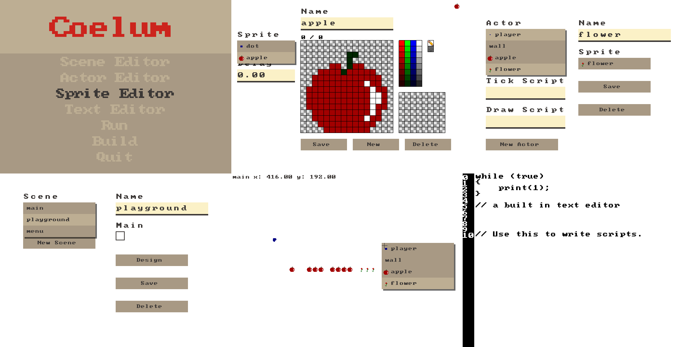
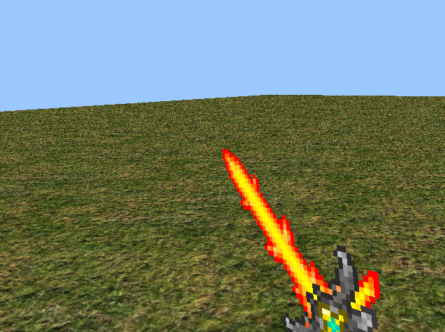
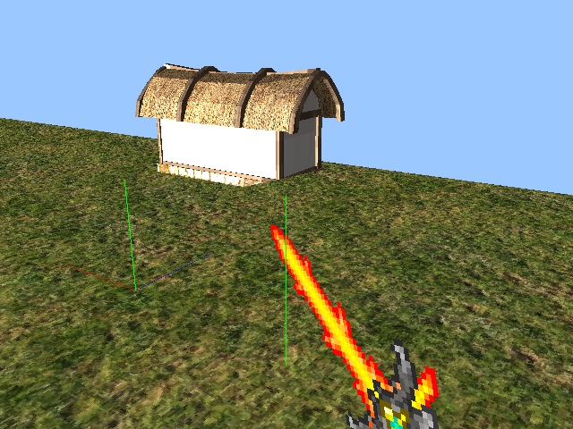

# Coelum
> A a toy and a game engine for the creative person.  
> The purpose of Coelum is to bring joy to who ever that wants to express his or hers creativity.

## Features
### Simple User Interface

### 2D Rendering

### 3D Rendering

### OpenAL Sound

### Simple Lighting engine


## Installing everything
> To get everything to work, including the GUI; you will need to compile and
> install the following on your machine:

* [Coelum (The core framework)](https://github.com/sebbekarlsson/coelum)
* [Athena (The DB wrapper)](https://github.com/sebbekarlsson/athena)
* [Apollon (The GUI)](https://github.com/sebbekarlsson/apollon)
* [Leto (The launcher)](https://github.com/sebbekarlsson/leto)
* [SPR (The sprite file format)](https://github.com/sebbekarlsson/spr)
* [libjson (JSON parser)](https://github.com/sebbekarlsson/libjson)
* [Hermes (The scriptig language)](https://github.com/sebbekarlsson/hermes)

> That is a lot of stuff right? I am planning on writing some sort of install-
> script that just installs everything, but for now; you have to do it manually.

> **NOTE** If you only want to make applications using only the `core`, then you
> do not need to install _all_ of these, then you only need to install `coelum`.

## Installing Coelum
### Requirements
> Install these:

    # if you are on debian / ubuntu
    apt-get install libglfw3-dev libaudio-dev

    # also clone and install cglm
    git clone git@github.com:recp/cglm.git

    # also clone and install hermes
    git clone git@github.com:sebbekarlsson/hermes.git

    # also clone and install objload
    git clone git@github.com:sebbekarlsson/objload.git

    # also clone and install spr
    git clone git@github.com:sebbekarlsson/spr.git

    # if you are on a Mac OSX, install these:
    brew install automake
    brew install libtool
    brew install openal-soft
    brew install glfw3

> You will also need GLAD (no matter what OS you are using):

    pip install --upgrade git+https://github.com/dav1dde/glad.git#egg=glad

    glad --generator=c --extensions=GL_EXT_framebuffer_multisample,GL_EXT_texture_filter_anisotropic --out-path=GL

> Then, to install the Coelum core, just run this:

    make && sudo make install

## Using The Core
> Here is the minimal required code to get a game up and running using only
> the core:
```C
#include <coelum/main.h>
#include <coelum/scene.h>
#include <coelum/theatre.h>
#include <coelum/constants.h>
#include <coelum/scene.h>
#include <coelum/actor.h>


extern theatre_T* THEATRE;

#ifndef GL_RGBA
#define GL_RGBA 0x1908
#endif

scene_T* init_scene_main()
{
    // creating a scene                          tick        draw     (2 dimensions)
    scene_T* s = scene_constructor(init_scene(), (void*) 0, (void*) 0, 2);
    s->bg_r = 154;
    s->bg_g = 55;
    s->bg_g = 200;

    // creating an actor
    actor_T* a = actor_constructor(
        init_actor(),
        (640 / 2) - 32,
        (480 / 2) - 32,
        0.0f,
        (void*) 0, // tick method
        (void*) 0, // draw method
        "cherry"
    );
    a->width = 64;
    a->height = 64;
    a->sprite = init_sprite_from_file("cherry.png", GL_RGBA, 1.0f, a->width, a->height); 
   
    // adding the actor to the scene 
    dynamic_list_append(((state_T*)s)->actors, a);

    return s;
} 

int main(int argc, char* argv[])
{
    coelum_init();

    scene_manager_register_scene(THEATRE->scene_manager, (scene_T*) init_scene_main());

    return coelum_main(argc, argv);
}
```
> Paste the code into a `main.c` file, and compile it like this:
```bash
gcc `pkg-config --cflags coelum` main.c `pkg-config --libs coelum`
```
> (Note, make sure you have a `cherry.png` file where you run the code).  
> Then run it:
```bash
./a.out
```
> You should now see something like this:


## Story
> This game engine was originally a pong game, the engine was later separated
> from the game, and the game was separated from the engine.  
> The pong game can be found here: [https://github.com/sebbekarlsson/cpong](https://github.com/sebbekarlsson/cpong)

## Contributing
### Linting
> To check for warnings in the coelum source code, you can run:

    make lint

> Make sure you have installed `clang` and `clang-tidy` before you do this.
